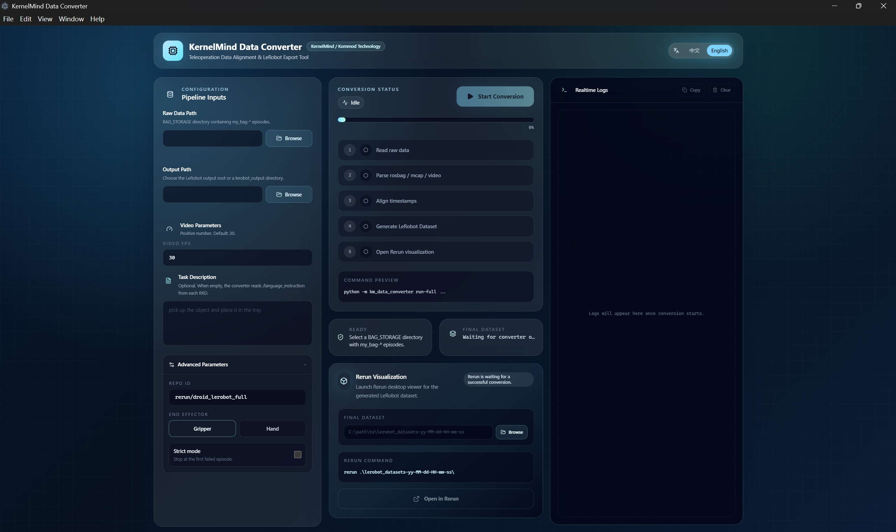
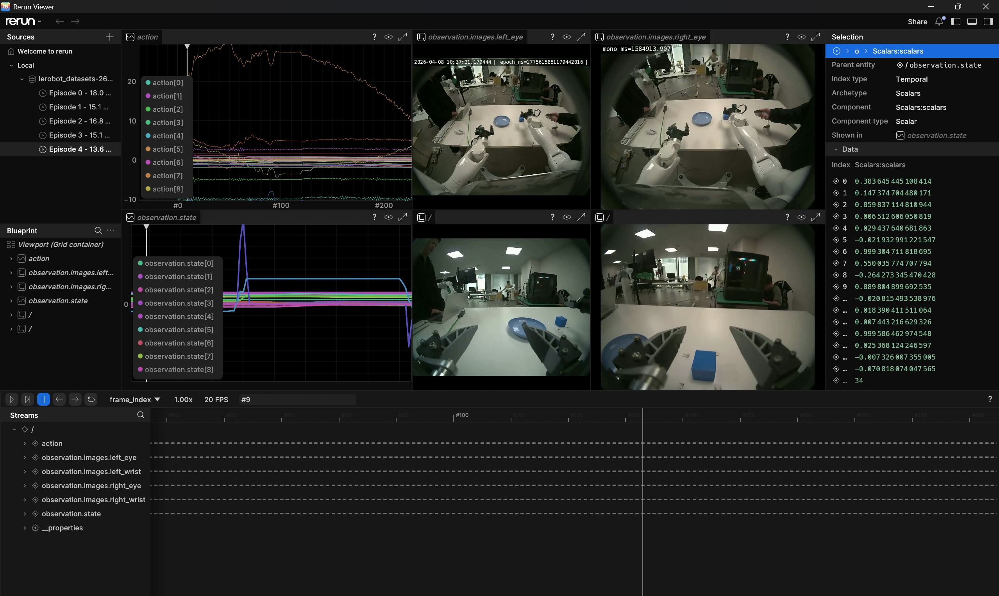

# KM Data Converter

A conversion toolkit for robot imitation-learning datasets. It takes raw MCAP data and four-camera video recordings from `BAG_STORAGE`, aligns them, and exports a LeRobot v3.0 dataset.

## Highlights

- Convert raw robot recordings into a LeRobot v3.0 dataset in one command
- Split a 2x2 tiled camera video into four views: left eye, right eye, left wrist, and right wrist
- Export robot state from MCAP to RRD and align it with video frames
- Use the Electron desktop UI to choose paths, set FPS, enter task text, and view live logs
- Inspect converted datasets and robot state in Rerun

## Pipeline

```text
BAG_STORAGE raw recordings
  -> Split four camera videos
  -> Export MCAP to RRD
  -> Align video with robot state
  -> Export LeRobot dataset
  -> Inspect with Rerun
```

Each episode directory should use this layout:

```text
BAG_STORAGE/
  my_bag-yy-MM-dd-HH-mm-ss/
    data/
      data_0.mcap
    video/
      cameras.mp4
      cameras_first_frame.yaml
```

The default `cameras.mp4` 2x2 layout is:

```text
left_eye      right_eye
left_wrist    right_wrist
```

## Installation

Python 3.10 to 3.12 is recommended.

```powershell
pip install -e .
pip install rerun-sdk[all]
pip install -e .\examples\python\rerun_export
```

If your environment is still missing video or YAML dependencies, install them as well:

```powershell
pip install opencv-python pyyaml
```

## Desktop UI

The project includes an Electron UI for daily conversion work.



```powershell
cd .\km_data_converter_UI
npm install
npm run dev
```

Use the UI to select the `BAG_STORAGE` source directory and output directory, set the target FPS, enter the task description, configure advanced options, and start the full conversion workflow. The UI shows progress, live logs, the final dataset path, and a button for opening the result in Rerun.



## Command-Line Conversion

Place all recording directories under `BAG_STORAGE`, then run:

```powershell
python -m km_data_converter run-full
```

You can also pass the input and output paths explicitly:

```powershell
python -m km_data_converter run-full <bag_storage_path> [output_root_path]
```

Common options:

```powershell
python -m km_data_converter run-full ^
  --bag-storage BAG_STORAGE ^
  --target-fps 10 ^
  --output-dir OUTPUT_DIR ^
  --repo-id rerun/droid_lerobot_full ^
  --end-effector {gripper,hand} ^
  --task-description TASK_DESCRIPTION ^
  --strict
```

The default output layout is:

```text
datasets/
  mcap2rrd/
  video2rrd/
  lerobot_output/
```

The final LeRobot dataset usually contains `data`, `meta`, and `videos` directories.

## Step-by-Step Usage

You can also run each stage separately for debugging or partial conversion.

Split the tiled camera video:

```powershell
python -m km_data_converter split-video
```

Convert MCAP to RRD:

```powershell
python -m km_data_converter mcap-to-rrd ^
  --bag-storage .\BAG_STORAGE ^
  --output-dir .\datasets\mcap2rrd
```

Write video and robot state into a new aligned RRD:

```powershell
python -m km_data_converter video-to-rrd ^
  --bag-storage .\BAG_STORAGE ^
  --dataset-dir .\datasets\mcap2rrd ^
  --output-dir .\datasets\video2rrd
```

Export the LeRobot dataset:

```powershell
python -m km_data_converter rrd-to-lerobot ^
  --input-dir .\datasets\video2rrd ^
  --output-root .\datasets\lerobot_output\lerobot_datasets
```

To override the task description for every frame, pass a fixed task string:

```powershell
python -m km_data_converter rrd-to-lerobot ^
  --input-dir .\datasets\video2rrd ^
  --output-root .\datasets\lerobot_output\lerobot_datasets ^
  --task-description TASK_DESCRIPTION
```

## Main Commands

| Command | Description |
| --- | --- |
| `python -m km_data_converter run-full` | Run the full conversion workflow |
| `python -m km_data_converter split-video` | Split `cameras.mp4` into four camera videos |
| `python -m km_data_converter mcap-to-rrd` | Export `mcap2rrd.rrd` for each episode |
| `python -m km_data_converter video-to-rrd` | Align video with robot state and generate `video2rrd` |
| `python -m km_data_converter rrd-to-lerobot` | Merge multiple RRD files into one LeRobot dataset |

## Data Fields

### Action

The `action` vector has 56 dimensions in a fixed order:

```text
action = [effort(14), position(14), velocity(14), control_A(7), control_B(7)]
```

Where:

- 0-13: joint effort from `/joint_states/effort`
- 14-27: joint position from `/joint_states/position`
- 28-41: joint velocity from `/joint_states/velocity`
- 42-48: left arm control command from `/control/joint_cmd_A`
- 49-55: right arm control command from `/control/joint_cmd_B`

### Observation State

The `observation.state` vector has 26 dimensions in a fixed order:

```text
observation.state = [eef_left(7), eef_right(7), gripper_feedback_L(6), gripper_feedback_R(6)]
```

Where:

- `eef_left`: 7D left end-effector pose
- `eef_right`: 7D right end-effector pose
- `gripper_feedback_L`: 6D left gripper feedback
- `gripper_feedback_R`: 6D right gripper feedback

End-effector pose fields are ordered as:

```text
pose.position.x, pose.position.y, pose.position.z,
pose.orientation.x, pose.orientation.y, pose.orientation.z, pose.orientation.w
```

## Marvin_pro URDF

To augment an existing `video2rrd` file with the Marvin URDF and aligned joint transforms, run:

```powershell
python -m km_data_converter.urdf ^
  --input-rrd .\datasets\video2rrd\video2rrd-yy-MM-dd-HH-mm-ss.rrd ^
  --output-rrd .\datasets\video2rrd\video2rrd-yy-MM-dd-HH-mm-ss-with-urdf.rrd ^
  --no-spawn
```

Common options:

- `--input-rrd`: existing `video2rrd` file to augment
- `--output-rrd`: output RRD path; if omitted, a `-with-urdf.rrd` file is created next to the input file
- `--xacro`: optional xacro path; defaults to the Marvin M6 model in this repository
- `--output-urdf`: optional output path for the expanded URDF
- `--no-spawn`: do not open a Rerun viewer automatically

## Rerun Visualization

Install Rerun:

```powershell
pip install rerun-sdk[all]
```

Then open a dataset from `datasets\lerobot_output`:

```powershell
rerun .\lerobot_datasets-yy-MM-dd-HH-mm-ss\
```

Replace `yy-MM-dd-HH-mm-ss` with the actual generated dataset timestamp folder.

## Notes

- Episode directory names must start with `my_bag-yy-MM-dd-HH-mm-ss`
- `video-to-rrd` requires all four split video files to exist
- `video-to-rrd` writes sensor dashboard videos into each episode's `video` directory
- By default, scripts skip bad episodes and continue; with `--strict`, they stop on the first error
- Converting new data can overwrite old intermediate results under `datasets`; save any RRD files or datasets you need to keep
- Before converting a new batch, clean up or replace old recording directories in `BAG_STORAGE`
