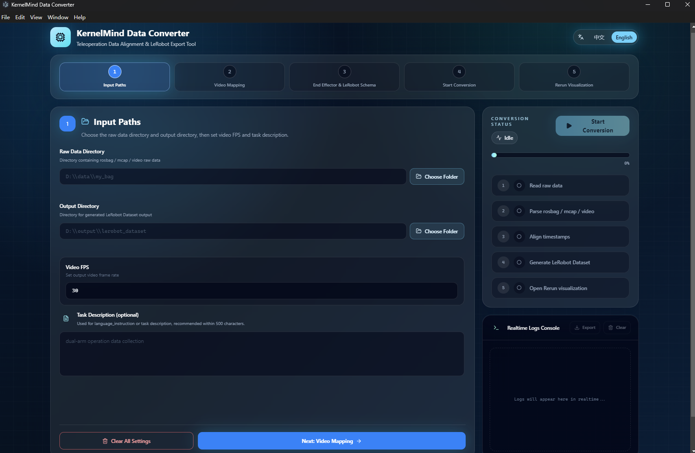
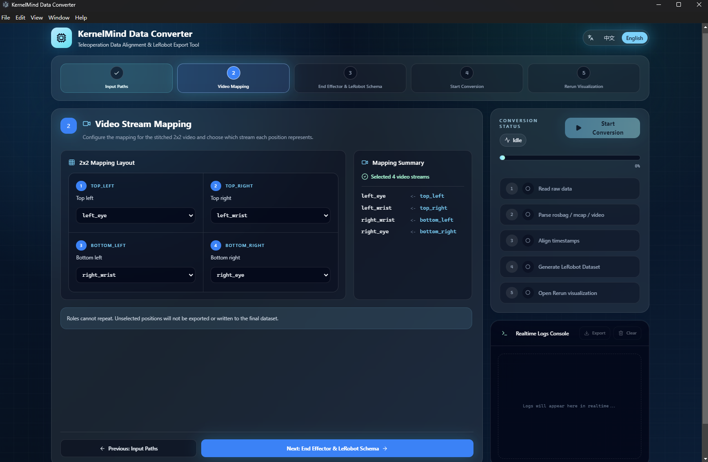
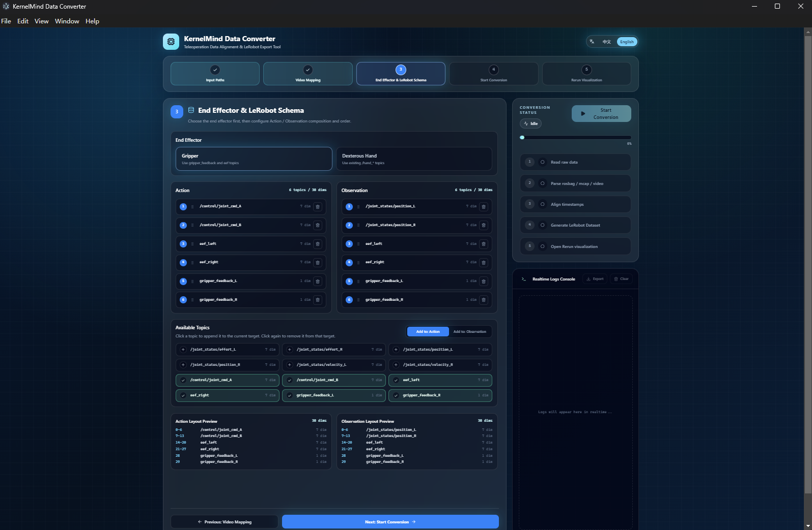
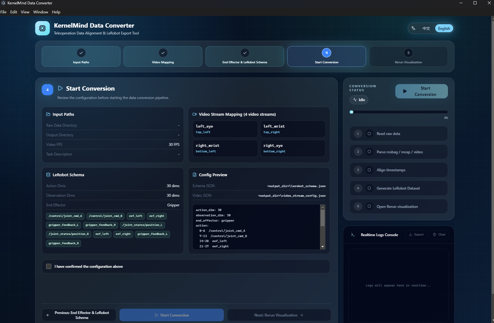
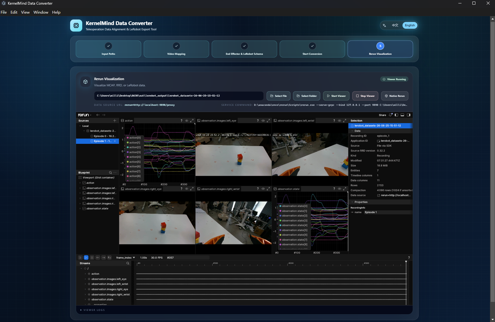

# KernelMind Data Converter Guide

KernelMind Data Converter is a conversion tool for teleoperation and robot datasets. It organizes MCAP files, camera videos, and timestamp information from raw `BAG_STORAGE/my_bag-*` recording directories into trainable LeRobot v3 datasets. It also provides an Electron desktop UI for path selection, video stream mapping, end-effector selection, LeRobot Schema configuration, conversion progress, and Rerun visualization.

## Core Features

- Run the full pipeline in one click: split `cameras.mp4`, convert MCAP, align video with robot state, and export a LeRobot Dataset.
- Support custom mapping for 2x2 stitched videos. One or more video streams from `left_eye`, `right_eye`, `left_wrist`, and `right_wrist` can be written to the dataset.
- Support `gripper` gripper mode and `hand` dexterous hand mode.
- Support configurable LeRobot `action` and `observation.state` composition order. The UI displays topic count and total dimensions in real time.
- Built-in live logs, log export, pause, resume, and stop conversion.
- Built-in Rerun Web Viewer for `.mcap`, `.rrd`, `.rbl`, or LeRobot dataset directories. Native Rerun can also be opened.
- Provides the raw data quality check command `quality-check`, which can generate quality reports before conversion.

## Raw Data Directory Requirements

The input directory must contain one or more `my_bag-*` episode directories:

```text
BAG_STORAGE/
  my_bag-yy-MM-dd-HH-mm-ss/
    data/
      data_0.mcap
    video/
      cameras.mp4
      cameras_first_frame.yaml
```

Key files:

| File | Purpose |
| --- | --- |
| `data/data_0.mcap` | Raw ROS / robot state recording. |
| `video/cameras.mp4` | 2x2 camera video. |
| `video/cameras_first_frame.yaml` | Absolute timestamp of the first frame. The file must contain `first_frame_time.epoch_ns`. |

Episode directory names must start with `my_bag-`. The final generated dataset directory is named with the earliest episode timestamp.

## Installation

Python `3.10` to `3.12` is recommended.

```powershell
pip install -e .
```

```powershell
pip install rerun-sdk[all]
```

```powershell
pip install -e .\examples\python\rerun_export
```

## Start The Desktop UI

The desktop app is located in `km_data_converter_UI` and uses Electron + Vite + React.

```powershell
cd .\km_data_converter_UI
npm install
npm run build
npm run dev
```

`node_modules/` is created by `npm install`. `dist/`.
`dist-electron/` are build outputs created by commands such as `npm run build`. 
After startup, the UI opens the `KernelMind Data Converter` window.

## 5-Step Frontend Workflow

### 1. Input Paths



Fill in or select the following in `Input Paths`:

- Raw data directory: the `BAG_STORAGE` directory containing `my_bag-*`.
- Output directory: intermediate RRD files, config files, and the final LeRobot dataset are written here.
- Video FPS: output FPS for split videos. The UI default is `30`. It is recommended to set the output video FPS lower than the original video FPS.
- Task description: optional task text written to the final dataset.

### 2. Video Stream Mapping



The tool treats `video/cameras.mp4` as a 2x2 frame and splits it into independent videos according to the mapping.

Available positions:

```text
top_left       top_right
bottom_left    bottom_right
```

Available video roles:

```text
None / unused
left_eye
right_eye
left_wrist
right_wrist
```

Default mapping:

```json
{
  "video_streams": [
    { "grid": "top_left", "role": "left_eye" },
    { "grid": "top_right", "role": "left_wrist" },
    { "grid": "bottom_left", "role": "right_wrist" },
    { "grid": "bottom_right", "role": "right_eye" }
  ]
}
```

Notes:

- `grid` cannot be duplicated.
- `role` cannot be duplicated.
- At least one video stream must be selected.
- Unselected positions are not split, are not written to `video2rrd`, and are not included in the final LeRobot dataset.

### 3. End Effector And LeRobot Schema



First select the end-effector type:

| Type | Use case | Related topic |
| --- | --- | --- |
| `gripper` | Default gripper mode | `gripper_feedback_L`, `gripper_feedback_R` |
| `hand` | Dexterous hand mode | `/hand_left/*`, `/hand_right/*` |

Then configure the LeRobot `action` and `observation.state`. The UI supports adding or removing topics from the available topic list and previews each segment's dimension range in the vector in real time.

Default gripper schema:

```json
{
  "action": [
    "/control/joint_cmd_A",
    "/control/joint_cmd_B",
    "eef_left",
    "eef_right",
    "gripper_feedback_L",
    "gripper_feedback_R"
  ],
  "observation": [
    "/joint_states/position_L",
    "/joint_states/position_R",
    "eef_left",
    "eef_right",
    "gripper_feedback_L",
    "gripper_feedback_R"
  ]
}
```

Default dexterous hand schema:

```json
{
  "action": [
    "/control/joint_cmd_A",
    "/control/joint_cmd_B",
    "eef_left",
    "eef_right",
    "/hand_left/joint_commands/position",
    "/hand_right/joint_commands/position"
  ],
  "observation": [
    "/joint_states/position_L",
    "/joint_states/position_R",
    "eef_left",
    "eef_right",
    "/hand_left/joint_states/position",
    "/hand_right/joint_states/position",
    "/hand_left/joint_states/effort",
    "/hand_right/joint_states/effort"
  ]
}
```

Available topic dimensions:

| Topic | Dimensions |
| --- | ---: |
| `/joint_states/effort_L`, `/joint_states/effort_R` | 7 |
| `/joint_states/position_L`, `/joint_states/position_R` | 7 |
| `/joint_states/velocity_L`, `/joint_states/velocity_R` | 7 |
| `/control/joint_cmd_A`, `/control/joint_cmd_B` | 7 |
| `eef_left`, `eef_right` | 7 |
| `gripper_feedback_L`, `gripper_feedback_R` | 1 |
| `/hand_left/joint_commands/position`, `/hand_right/joint_commands/position` | 20 |
| `/hand_left/joint_states/position`, `/hand_right/joint_states/position` | 20 |
| `/hand_left/joint_states/effort`, `/hand_right/joint_states/effort` | 20 |

Implementation details:

- `/joint_states/*_L` and `/joint_states/*_R` come from splitting a 14-dimensional joint state vector into left and right 7-dimensional parts.
- `eef_left` and `eef_right` use position and quaternion, for 7 dimensions in total.
- `gripper_feedback_L` and `gripper_feedback_R` use the gripper end travel, for 1 dimension in total.

### 4. Start Conversion



Before starting, the UI displays:

- Input path, output path, FPS, and task description.
- Number of video stream mappings and the specific `role <- grid`.
- Total Action / Observation dimensions.
- Paths of the config files that will be written.

After checking `I have confirmed the configuration above`, conversion can be started. The status panel on the right displays stage progress:

1. Read raw data
2. Parse rosbag / mcap / video
3. Timestamp alignment
4. Generate LeRobot Dataset
5. Open Rerun visualization

During conversion, you can use:

- Pause: suspend the current conversion process.
- Resume: resume the paused conversion.
- Stop conversion: terminate the current conversion process tree.
- Export logs: save the current live logs to `conversion_logs_*.txt` in the output directory.

### 5. Rerun Visualization



After conversion succeeds, enter the `Rerun Visualization` page. It supports selecting or entering:

- `.mcap`
- `.rrd`
- `.rbl`
- LeRobot dataset directory

After clicking `Start Viewer`, the desktop app starts the Rerun gRPC data service. The default data source address is similar to:

```text
rerun+http://localhost:9876/proxy
```

The UI embeds Rerun Web Viewer for inspection. You can also click `Native Rerun` to open it with the system `rerun` command.

## Output Directory Structure

Assuming the output directory selected in the UI is `D:\output\km_dataset`, conversion generates:

```text
D:\output\km_dataset\
  lerobot_schema.json
  video_stream_config.json
  mcap2rrd\
    mcap_to_rrd\
      my_bag-yy-MM-dd-HH-mm-ss\
        mcap2rrd.rrd
  video2rrd\
    video2rrd-yy-MM-dd-HH-mm-ss.rrd
  lerobot_output\
    lerobot_datasets-yy-MM-dd-HH-mm-ss\
      data\
      meta\
        stats.json
      videos\
```

Description:

- `lerobot_schema.json` records the final `action` and `observation` topic order.
- `video_stream_config.json` records the mapping from 2x2 video positions to cameras.
- `mcap2rrd` stores intermediate results exported from the raw MCAP state.
- `video2rrd` stores each episode RRD after video and robot state alignment.
- `lerobot_output/lerobot_datasets-*` is the final trainable dataset.

```text
The final generated LeRobot-format dataset is named with the earliest episode timestamp.
```

## Rerun Command Line Viewing

If you do not use the embedded desktop Viewer, you can also run:

```powershell
rerun D:\output\km_dataset\lerobot_output\lerobot_datasets-yy-MM-dd-HH-mm-ss
```
