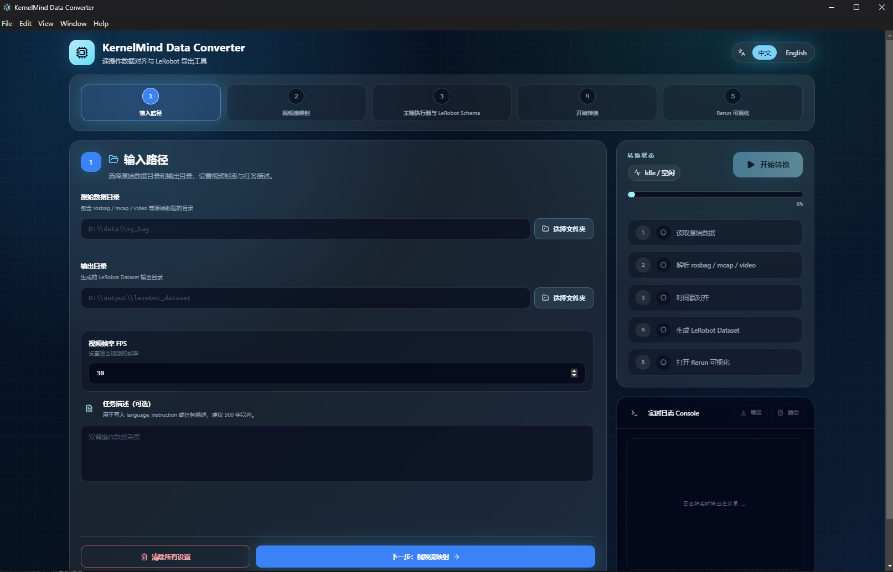
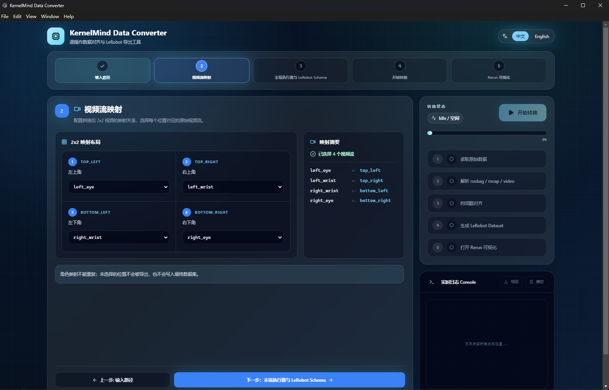
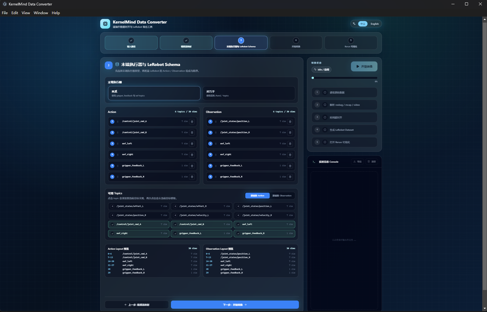
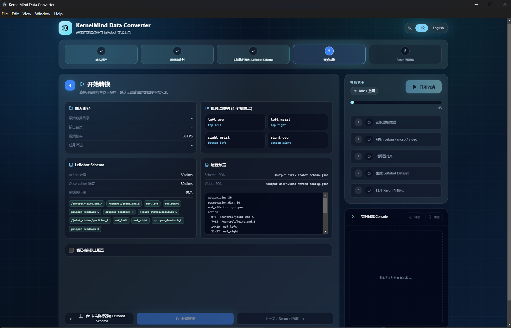

# KernelMind Data Converter 工具说明

KernelMind Data Converter 是面向遥操作与机器人数据集的转换工具。它将原始 `BAG_STORAGE/my_bag-*` 采集目录中的 MCAP、相机视频和时间戳信息整理为可训练的 LeRobot v3 数据集，并提供 Electron 桌面界面完成路径选择、视频流映射、末端执行器选择、LeRobot Schema 配置、转换进度查看和 Rerun 可视化。

## 核心能力

- 一键执行完整流水线：`cameras.mp4` 拆分、MCAP 转换、视频与机器人状态对齐、导出 LeRobot Dataset。
- 支持 2x2 拼接视频的自定义映射，可选择 `left_eye`、`right_eye`、`left_wrist`、`right_wrist` 中的一个或多个视频流写入数据集。
- 支持 `gripper` 夹爪模式和 `hand` 灵巧手模式。
- 支持可配置 LeRobot `action` 与 `observation.state` 组成顺序，界面会实时显示 topic 数量和总维度。
- 内置实时日志、日志导出、暂停、继续、停止转换。
- 内置 Rerun Web Viewer，可查看 `.mcap`、`.rrd`、`.rbl` 或 LeRobot 数据集目录；也可打开原生 Rerun。
- 提供原始数据质量检查命令 `quality-check`，可在转换前生成质量报告。

## 原始数据目录要求

输入目录需要包含一个或多个 `my_bag-*` episode 目录：

```text
BAG_STORAGE/
  my_bag-yy-MM-dd-HH-mm-ss/
    data/
      data_0.mcap
    video/
      cameras.mp4
      cameras_first_frame.yaml
```

关键文件说明：

| 文件 | 作用 |
| --- | --- |
| `data/data_0.mcap` | 原始 ROS/机器人状态记录。 |
| `video/cameras.mp4` | 2x2 相机视频。 |
| `video/cameras_first_frame.yaml` | 第一帧绝对时间戳，字段需要包含 `first_frame_time.epoch_ns`。 |

episode 目录名必须以 `my_bag-` 开头。最终生成使用最早的 episode 时间戳生成最终数据集目录名。

## 安装环境

推荐 Python `3.10` 到 `3.12`。

```powershell
pip install -e .
```

```powershell
pip install rerun-sdk[all]
```

```powershell
pip install -e .\examples\python\rerun_export
```

## 启动桌面界面

桌面端位于 `km_data_converter_UI`，使用 Electron + Vite + React。

```powershell
cd .\km_data_converter_UI
npm install
npm run build
npm run dev
```

执行 `npm install` 自动生成`node_modules/`；
执行 `npm run build` 自动生成`dist/` 和 `dist-electron/`。

界面启动后会打开 `KernelMind Data Converter` 窗口。

## 转换工具前端 5 步使用流程

### 1. 输入路径



在「输入路径」中填写或选择：

- 原始数据目录：包含 `my_bag-*` 的 `BAG_STORAGE` 目录。
- 输出目录：中间 RRD、配置文件和最终 LeRobot 数据集都会写入这里。
- 视频帧率 FPS：拆分后的视频输出帧率。界面默认值为 `30`。建议将视频输出帧率设置为低于原始视频的帧率。
- 任务描述：可选，写入最终数据集任务文本。

### 2. 视频流映射



工具会把 `video/cameras.mp4` 视为 2x2 画面，并根据映射关系拆分为独立视频。

可用位置：

```text
top_left       top_right
bottom_left    bottom_right
```

可用视频角色：

```text
None / 不使用
left_eye
right_eye
left_wrist
right_wrist
```

默认映射为：

```json
{
  "video_streams": [
    { "grid": "top_left", "role": "left_eye" },
    { "grid": "top_right", "role": "left_wrist" },
    { "grid": "bottom_left", "role": "right_wrist" },
    { "grid": "bottom_right", "role": "right_eye" }
  ]
}
```

注意：

- `grid` 不能重复。
- `role` 不能重复。
- 至少选择一个视频流。
- 未选择的位置不会被拆分、不会写入 `video2rrd`，也不会进入最终 LeRobot 数据集。

### 3. 末端执行器与 LeRobot Schema



先选择末端执行器类型：

| 类型 | 使用场景 | 相关 topic |
| --- | --- | --- |
| `gripper` | 默认夹爪模式 | `gripper_feedback_L`、`gripper_feedback_R` |
| `hand` | 灵巧手模式 | `/hand_left/*`、`/hand_right/*` |

然后配置 LeRobot 的 `action` 和 `observation.state`。界面支持从可用 topic 列表中添加或移除 topic，并实时预览每一段在向量中的维度范围。

夹爪模式默认 Schema：

```json
{
  "action": [
    "/control/joint_cmd_A",
    "/control/joint_cmd_B",
    "eef_left",
    "eef_right",
    "gripper_feedback_L",
    "gripper_feedback_R"
  ],
  "observation": [
    "/joint_states/position_L",
    "/joint_states/position_R",
    "eef_left",
    "eef_right",
    "gripper_feedback_L",
    "gripper_feedback_R"
  ]
}
```

灵巧手模式默认 Schema：

```json
{
  "action": [
    "/control/joint_cmd_A",
    "/control/joint_cmd_B",
    "eef_left",
    "eef_right",
    "/hand_left/joint_commands/position",
    "/hand_right/joint_commands/position"
  ],
  "observation": [
    "/joint_states/position_L",
    "/joint_states/position_R",
    "eef_left",
    "eef_right",
    "/hand_left/joint_states/position",
    "/hand_right/joint_states/position",
    "/hand_left/joint_states/effort",
    "/hand_right/joint_states/effort"
  ]
}
```

可用 topic 维度：

| Topic | 维度 |
| --- | ---: |
| `/joint_states/effort_L`、`/joint_states/effort_R` | 7 |
| `/joint_states/position_L`、`/joint_states/position_R` | 7 |
| `/joint_states/velocity_L`、`/joint_states/velocity_R` | 7 |
| `/control/joint_cmd_A`、`/control/joint_cmd_B` | 7 |
| `eef_left`、`eef_right` | 7 |
| `gripper_feedback_L`、`gripper_feedback_R` | 1 |
| `/hand_left/joint_commands/position`、`/hand_right/joint_commands/position` | 20 |
| `/hand_left/joint_states/position`、`/hand_right/joint_states/position` | 20 |
| `/hand_left/joint_states/effort`、`/hand_right/joint_states/effort` | 20 |

实现细节：

- `/joint_states/*_L` 和 `/joint_states/*_R` 来自 14 维关节状态向量的左右 7 维拆分。
- `eef_left`、`eef_right` 使用位置和四元数，共 7 维。
- `gripper_feedback_L`、`gripper_feedback_R` 使用夹爪末端的行程， 共 1 维。

### 4. 开始转换



开始前界面会展示：

- 输入路径、输出路径、FPS、任务描述。
- 视频流映射数量和具体 `role <- grid`。
- Action / Observation 总维度。
- 将写入的配置文件路径。

勾选「我已确认以上配置」后即可启动转换。右侧状态面板会显示阶段进度：

1. 读取原始数据
2. 解析 rosbag / mcap / video
3. 时间戳对齐
4. 生成 LeRobot Dataset
5. 打开 Rerun 可视化

转换过程中可使用：

- 暂停：挂起当前转换进程。
- 继续：恢复已暂停的转换。
- 停止转换：终止当前转换进程树。
- 导出日志：保存当前实时日志到输出目录中的 `conversion_logs_*.txt`。

### 5. Rerun 可视化


转换成功后可以进入「Rerun 可视化」页。它支持选择或输入：

- `.mcap`
- `.rrd`
- `.rbl`
- LeRobot 数据集目录

点击「启动 Viewer」后，桌面端会启动 Rerun gRPC 数据服务，默认数据源地址类似：

```text
rerun+http://localhost:9876/proxy
```

界面会嵌入 Rerun Web Viewer 进行查看。也可以点击「原生 Rerun」用系统里的 `rerun` 命令打开。

## 输出目录结构

假设界面中选择输出目录为 `D:\output\km_dataset`，转换会生成：

```text
D:\output\km_dataset\
  lerobot_schema.json
  video_stream_config.json
  mcap2rrd\
    mcap_to_rrd\
      my_bag-yy-MM-dd-HH-mm-ss\
        mcap2rrd.rrd
  video2rrd\
    video2rrd-yy-MM-dd-HH-mm-ss.rrd
  lerobot_output\
    lerobot_datasets-yy-MM-dd-HH-mm-ss\
      data\
      meta\
        stats.json
      videos\
```

说明：

- `lerobot_schema.json` 记录最终 `action` 和 `observation` topic 顺序。
- `video_stream_config.json` 记录 2x2 视频位置到相机的映射。
- `mcap2rrd` 保存 MCAP 原始状态导出的中间结果。
- `video2rrd` 保存对齐视频和机器人状态后的每 episode RRD。
- `lerobot_output/lerobot_datasets-*` 是最终可训练数据集。

```
最终生成的lerobot格式数据集是以最早 episode 的时间戳命名的。
```

## Rerun 命令行查看

如果不使用桌面端嵌入 Viewer，也可以直接运行:

```powershell
rerun D:\output\km_dataset\lerobot_output\lerobot_datasets-yy-MM-dd-HH-mm-ss
```
